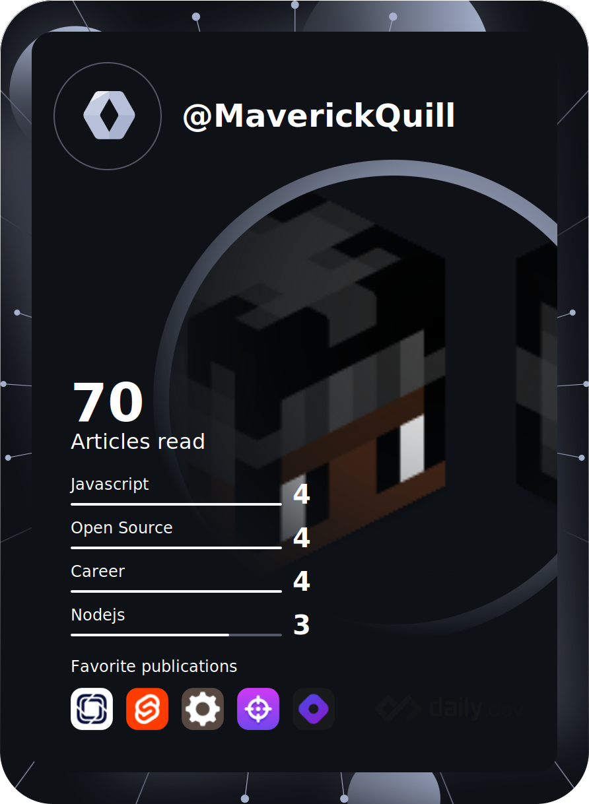

 
 

 
 
AD

 Want good servers with a free $5/month usage? try [railway](https://railway.app?referralCode=ToxikDevs), Ready to upgrade? go to your [account page](https://railway.app/account/billing), Scroll to "Upgrade to Developer Plan", add a valid card and hit upgrade  
 # More info about the plan
 *The plan does a verification charge each month, dont use a fake/empty card or it wont work!*
 The plan doesnt do any other charges than to verify the card has money, if your usage goes over $10 you will be charged whatever your extra usage is  
 

- 👋 Hi, I’m @mavthedev
- 👀 I’m intrested in Svelte(kit) and Javascript
- I own @cons0r

Tip: Press <kbd>.</kbd> to open a repo in an online vscode editor (no terminal or debugger tho)
